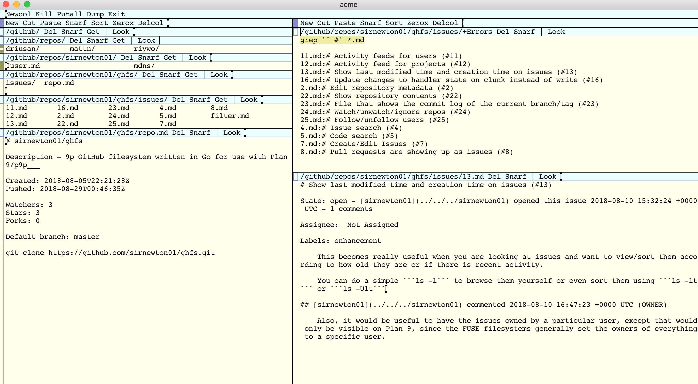

# GitHub File System

With this filesystem you can use GitHub from the freedom of your favorite shell and text editor.
In particular, you can use this to mount GitHub onto a Plan 9 system and use it to collaborate
on projects with other Plan 9 users. Content is presented either in plain text or rich markdown
for ease of viewing or converting them into graphical formats for offline reading.

## Current feature set
* Browse repositories by owner
* Read open issues

## Examples

```
$ ls /github/repos/sirnewton01

9p-mdns				godev				plan9adapter
Rest.ServiceProxy		godev-oracle			projectcreator
dgit				gojazz				rpi-9front
eclipse-filesystem-example	mdns				rtcdocker
gdblib				ninep				society-tests
ghfs				orion.client			ttf2plan9
git				orion.server			xinu
go				p9-tutorial
godbg				plan9-font-hack

$ cat /github/repos/sirnewton01/ghfs/README.md

# sirnewton01/ghfs 

9p GitHub filesystem written in Go for use with Plan 9/p9p

Watchers: 1
Stars: 1
Forks: 0

DefaultBranch: master
Clone URL: https://github.com/sirnewton01/ghfs.git

$ cat mnt/repos/sirnewton01/ghfs/issues/1.md

# It is not clear which repos are forks and which are original (#1)

State: open - sirnewton01 opened this issue 2018-08-06 02:29:11 +0000 UTC - 0 comments

Assignee: 

    The README.md in the repo directory doesn't show whether the project is a fork. If it is a fork it doesn't show the original repo.

```



## End Goal
Once in a stable state it should be possible to use the GitHub filesystem to manage all of
your Plan 9 projects, create new ones, track issues and collaborate with other users. It
should be possible to use this in conjunction with a tool such as [dgit](https://github.com/driusan/dgit)
or a git filesystem to update/merge/patch/push changes to GitHub while keeping track
of the progress of the project.

## Get Started - Plan 9 Port
Install the latest plan9port. Run ghfs. Mount the filesystem with ```9 mount localhost:5640 <mount-point>```
assuming the default tcp port 5640.

## Authentication
The filesystem uses no authentication with GitHub by default. The rate limit is much lower in this mode.
You can generate a Personal Access Token in your Settings > Develper Settings screen. With a token you
can provide it in the command-line with the ```-apitoken``` flag.
